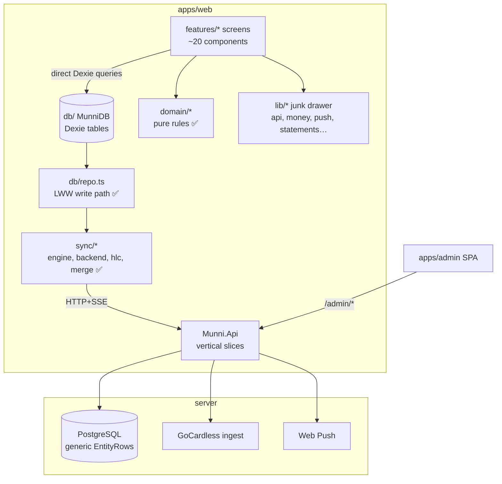
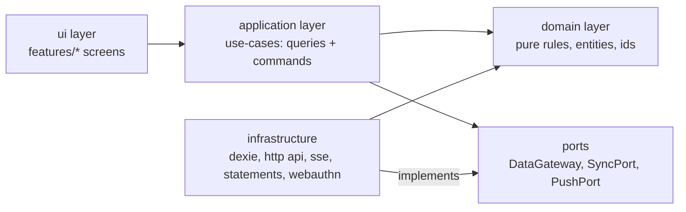
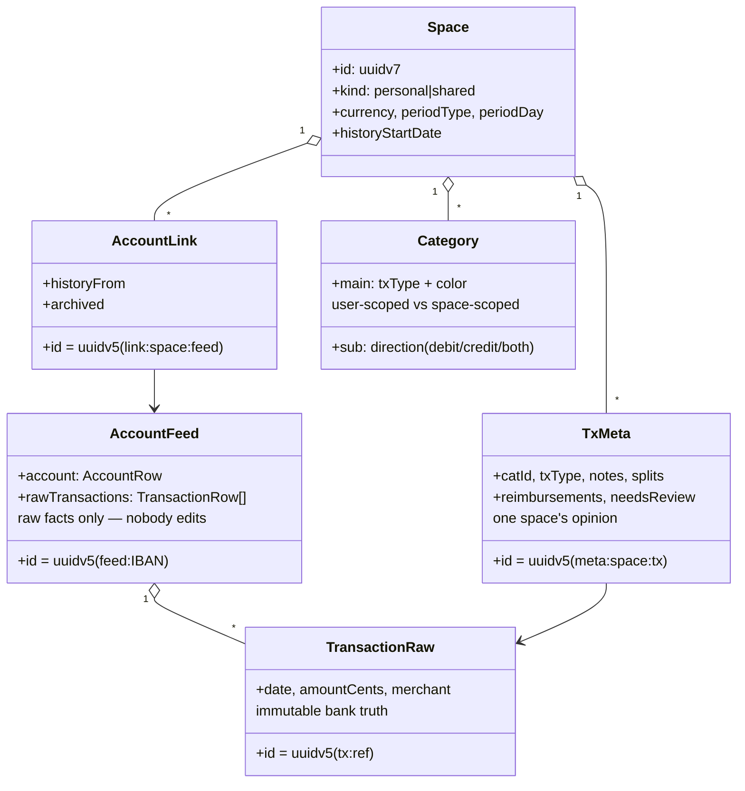

# Architecture review — munni (web, api, admin)

Status: review for discussion. Written deliberately harshly, as requested:
the reviewer's only loyalty is to the next developer who has to maintain
this. Legacy code (`apps/legacy`, `temporary/`) was used to understand the
domain only.

## Verdict in one paragraph

The foundations are better than the average AI-assembled codebase — the
sync core (HLC + per-field LWW + idempotent ops) is genuinely well
isolated and permutation-tested on both sides, domain rules live in pure
modules with real tests, and the server's vertical slices are thin and
readable. What is **not** acceptable for the long run: the web app has
no application layer, so twenty-odd screens talk to Dexie directly and
every data-model change (see feature B) turns into open-heart surgery
across the UI; `lib/` is a junk drawer; feature folders import each
other freely with zero enforced boundaries; and the client trusts its
own writes completely (validation exists only server-side). None of
this is fatal — but each month it stands, the price of fixing it grows.

## Current state

### What is genuinely good (keep, do not churn)

- `sync/` — engine, merge, hlc: small, pure, contract-tested against the
  C# twin. This is the crown jewel; nothing may import UI from here.
- `domain/` — categoryRules, overview, periods, splits, reimbursement,
  txType: pure functions, exhaustive tests. Correct instinct.
- Server vertical slices with a domain-agnostic sync store. The server
  not understanding finances is a feature.
- The write path: every mutation goes through `Repo` → LWW stamp →
  outbox. One door in.

### The sins

1. **No application layer (worst offender).** Screens compose Dexie
   queries inline (`db.transactions.where('[spaceId+date]')…` appears in
   four screens with subtle variations). Feature B's join layer
   (`db/joined.ts`) had to be bolted on precisely because there was no
   seam to put it behind. Consequence: every schema change touches
   screens; screens are untestable without a real database.
2. **No module boundaries.** `features/transactions` imports from
   `features/categories` and vice versa; `app/` imports `features/auth`;
   nothing stops a screen from importing the sync engine directly.
   Boundaries exist only by convention, and conventions rot.
3. **`lib/` junk drawer.** `api.ts` (infrastructure), `money.ts`
   (domain formatting), `push.ts` (infrastructure), `statements/`
   (domain parsing), `swBridge.ts` (infrastructure) — five unrelated
   responsibilities in one folder invite the next dumping.
4. **Anemic Repo + trusting client.** `repo.upsert(entity, …, fields)`
   accepts any partial with casts; client-side invariants (amount is an
   integer, date is ISO, catId exists) are enforced nowhere on the
   write path — only the server validates, and only shapes, not
   semantics. A bug in one screen can poison local state that then
   syncs everywhere.
5. **Server composition.** `Program.cs` is ~120 lines of service
   wiring, auth branching, middleware and endpoint mapping. Fine at
   this size, already smelly; each new concern (push, SSE, Scalar) got
   appended.
6. **Validation gaps.** Bodies are FluentValidated; route params
   (spaceId shapes) and query params are not. No rate limiting on
   auth-visible endpoints.
7. **i18n keys are stringly-typed at call sites** (`` t(`tx.type.${type}`) ``),
   which works only because the union type happens to cover it.

## Target architecture (pragmatic onion)

Not a rewrite. The same folders, with enforced direction of dependency:

- **domain/** (exists): entities + pure rules. Grows: `Transaction`,
  `TxMeta`, `AccountFeed` invariant helpers (`assertValidTx(fields)`),
  already-present rules stay.
- **application/** (new): one module per feature exposing hooks/functions
  the UI calls: `useSpaceTransactions(filter)`, `categorize(tx, catId)`,
  `attachAccount(...)`. This is where `db/joined.ts` moves; screens stop
  knowing Dexie exists.
- **infrastructure/**: `dexie/` (schema, repo), `http/` (api, sync
  backend), `push/`, `statements/`, `webauthn/`. `lib/` dissolves.
- **ui/**: screens + the shared component kit. Screens may import
  application + i18n + ui only.

Enforced with `eslint-plugin-boundaries` (or import-x rules): ui →
application → domain; infrastructure implements ports; nothing imports
ui. CI fails on violation — boundaries by law, not convention.

### Key aggregates

### Server target

Keep vertical slices (they are the right size for one API), but:
- `Program.cs` → thin; wiring moves to `Composition/` extension methods
  (`AddMunniAuth()`, `AddMunniSync()`, `AddMunniPush()`).
- `Domain/` folder for SpaceRoles + LwwMerge (pure, already are).
- Route-param + query validation via endpoint filters; ASP.NET rate
  limiter on `/sync/*` and `/friends/*`.
- Feature B P2 requirement (also a security fix): feed spaces must be
  created through an owning flow (GoCardless link or import API), never
  by the generic "first push creates the space" rule — deterministic
  feed ids are guessable from an IBAN (see security review).

## Refactor plan (phased, always green)

| Phase | Scope | Size | Risk |
|---|---|---|---|
| R1 | application layer: extract query/command hooks per feature, screens stop touching Dexie (seeded by `db/joined.ts`) | L | low — mechanical, tests exist |
| R2 | boundary lint (eslint-plugin-boundaries) + fix violations | M | low |
| R3 | dissolve `lib/` into infrastructure/ + domain/ | S | low |
| R4 | client write invariants (`assertValidTx` etc. in Repo) | M | medium — may surface latent bugs (good) |
| R5 | server Composition/ + param validation + rate limiting | M | low |

R1 is the one that pays for feature B: the raw/overlay migration then
happens behind `application/transactions` without touching a single
screen. Recommendation: do R1 interleaved with B P2-P4, not after.

**Nothing in this plan is a big-bang rewrite; every phase ships green.**
