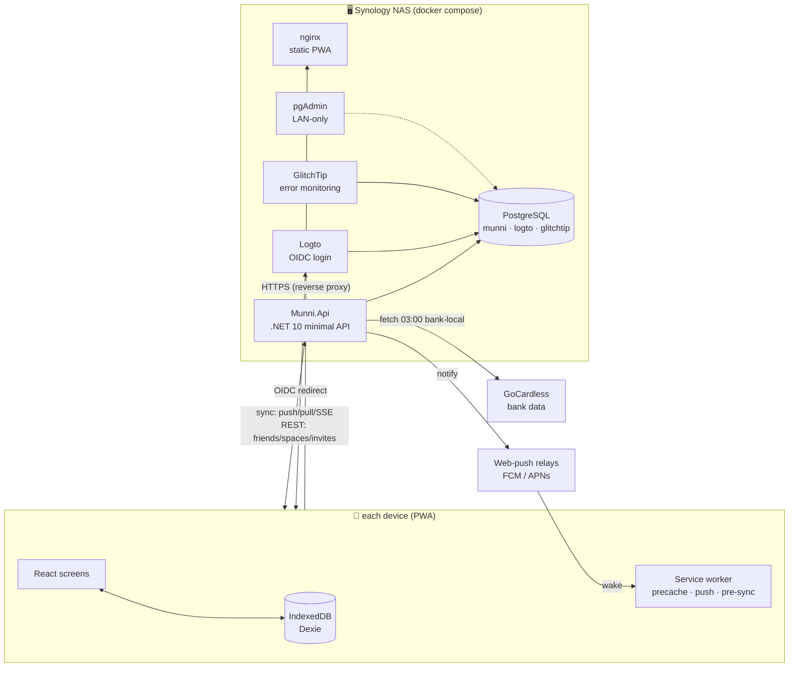
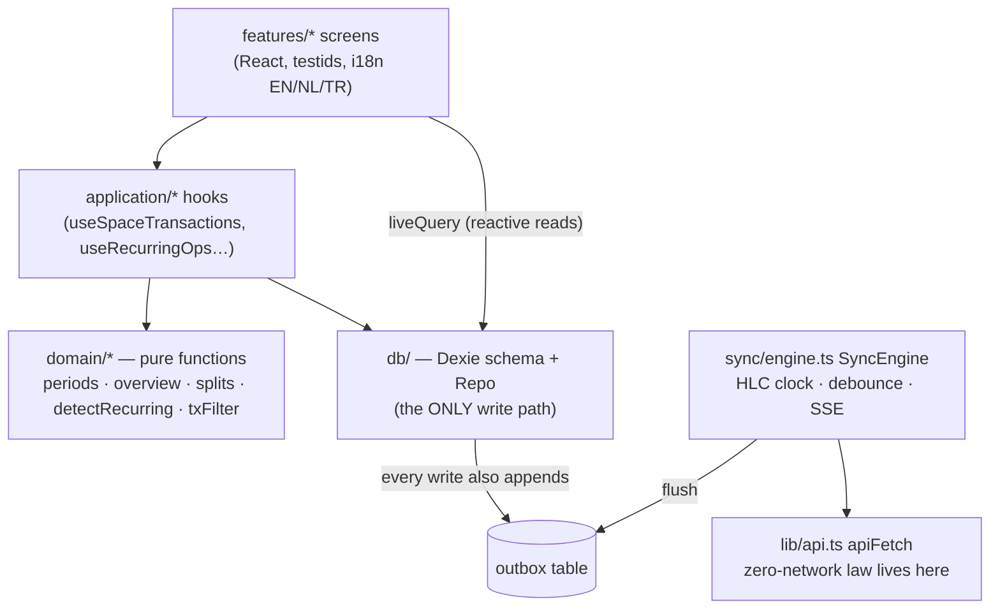
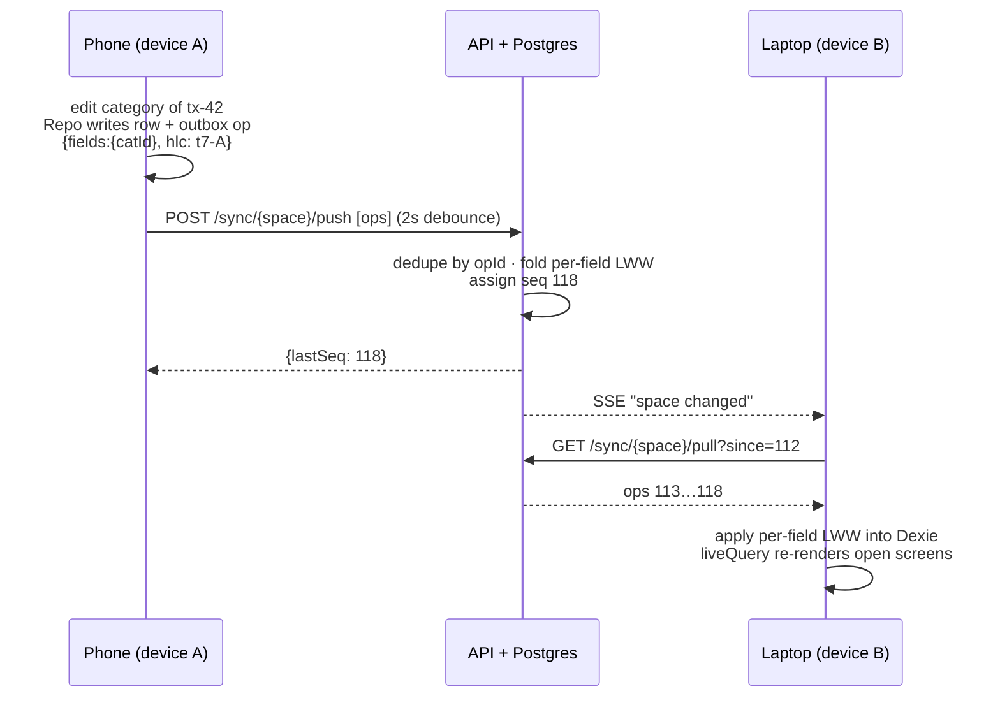
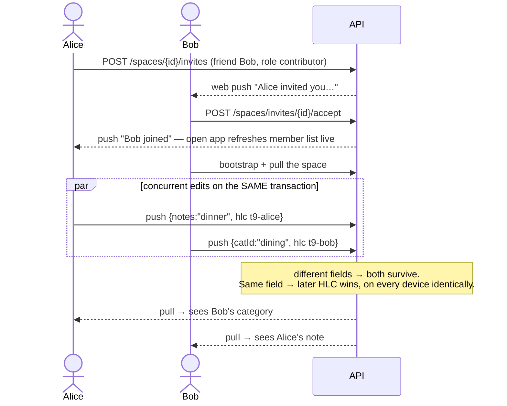
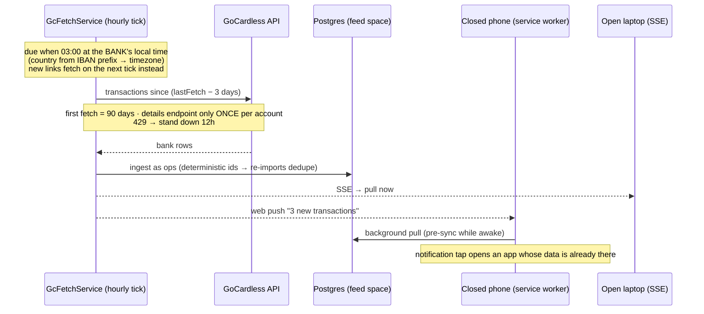

# munni — how it all works

A guided tour of the system: what runs where, how data flows, and what
happens when several people (and their devices) work on the same money.
Diagrams are [Mermaid](https://mermaid.js.org/) — GitHub renders them
inline.

## 1. Bird's eye

munni is **local-first**: every device keeps a full working copy of its
data in the browser's IndexedDB and works entirely from it. The server
is not "the app" — it is a sync relay + storage + the place where
things involving *other people* (accounts, invites, bank connections)
are mediated.

Three identity kinds run the **same app** with different wiring:

| Identity | Storage | Network | Telemetry |
|---|---|---|---|
| **user** (Logto) | IndexedDB per user | full sync + REST | queued offline, flushed online |
| **demo** | IndexedDB, reseeded on sign-out | **zero** — enforced at the `apiFetch` choke point | none, ever |
| **offline** profile | IndexedDB per profile, kept | **zero** | none, ever |

## 2. Frontend layering

The web app is layered so that everything interesting is a pure
function and everything stateful is thin:

Key rules:

- **Repo is the single write path.** It stamps every changed field with
  an HLC timestamp and appends an op to the outbox. Screens never touch
  Dexie tables directly for writes.
- **Reads are live.** Screens use `liveQuery`; when sync applies remote
  ops, every open screen re-renders by itself.
- **demo/offline get a `NoopSyncBackend`** — same Repo, same screens,
  the engine simply does nothing, and `apiFetch` *throws* for them so
  no forgotten code path can leak a request.

## 3. The sync protocol (one user, two devices)

Every piece of data belongs to a **space**. Each space has an append-only
op log on the server (`sync_ops`, with a per-space sequence) and a
materialized current state (`entity_rows`) the server keeps by folding
ops in — per **field**, latest HLC wins (LWW).

- **Offline is the normal case**: ops queue in the outbox for days if
  needed; on reconnect the engine flushes and pulls. Order of arrival
  never matters — HLC per field makes every interleaving converge.
- **New device**: `GET /sync/{space}/bootstrap` streams the materialized
  snapshot instead of replaying years of ops.
- Deletes are tombstones, so an offline device cannot resurrect a row.

## 4. Two people, one shared space

The server checks membership (`space_members`) on every sync call, but
stays **domain-agnostic** — it stores field bags, it does not know what
a "transaction" is. People-things (friendships, invites, membership,
roles) are classic REST, *not* synced data.

Editing presence ("Alice is reviewing — view only") rides the same SSE
channel, so two people rarely collide in the first place.

## 5. Bank data path (GoCardless)

Raw bank transactions are **stored once, in Postgres**, as ops in the
account's own **feed space** (`uuidv5("feed:" + IBAN)`). GoCardless is
only ever asked for the *delta*; clients never talk to GoCardless at
all — they sync from our copy like any other space.

The same deterministic-id trick makes a client-side **CAMT.053 file
import** of the same account merge cleanly with GoCardless data — the
file never leaves the device; only the resulting ops sync.

Rate budget math: GoCardless allows ~4 calls/endpoint/day. The nightly
schedule spends **1** transactions + **1** balances call per account per
day (details only on first link), leaving headroom for retries after a
429 deferral.

## 6. Notifications, three ways

| Path | When | How |
|---|---|---|
| **SSE** | app open | `/sync/events` → engine pulls; screens re-render via liveQuery; member lists/invites refresh on the same signal |
| **Web push** | app closed | server → FCM/APNs → service worker shows a localized notification (EN/NL/TR mirrored into worker storage) and pre-syncs the space |
| **Local reminders** | app opening | recurring-cost due-date reminders computed on device — the server never learns your recurring costs |

A notification **click** focuses the open app and posts a whitelisted
`NAVIGATE` message (friend request → Friends, invite → Spaces); a push
that arrives while the app is open is re-broadcast as a window event so
whatever screen you're watching refreshes in place.

## 7. What the server can and cannot see

- It sees space membership, op envelopes (entity name, field bags,
  HLCs) and bank data it fetched itself. That's what sync needs.
- It does **not** interpret finances: no category totals, no budgets,
  no reports server-side. All analysis (overview, recurring detection,
  budgets when they land) is client-side domain code — which is also
  why it works offline.
- Auth: Logto issues OIDC tokens; the API validates the bearer and
  provisions users just-in-time from `sub`. CI/test mode swaps in a
  header (`X-User-Sub`) so e2e can run without Logto.
- Errors: Sentry-protocol → GlitchTip; demo/offline identities send
  nothing, signed-in users queue crash reports offline and flush later.

## 8. Where things live

| Area | Path |
|---|---|
| Screens / features | `apps/web/src/features/*` |
| Pure domain logic | `apps/web/src/domain/*` |
| Dexie schema + Repo | `apps/web/src/db/*` |
| Sync engine + HLC | `apps/web/src/sync/*` |
| Service worker | `apps/web/src/sw.ts` (+ `sync/swNotifications.ts`) |
| API endpoints | `server/src/Munni.Api/*` (vertical slices) |
| Sync fold/merge (C# twin of the client) | `server/src/Munni.Api/Sync/*` |
| GoCardless ingest + schedule | `server/src/Munni.Api/GoCardless/*` |
| Compose stacks + runbook | `deploy/` |
| Design docs (approved) | `docs/shared-accounts-design.md` · `docs/budgets-design.md` · `docs/overview-drill-design.md` |

The authoritative sync semantics live in code, twice on purpose:
`apps/web/src/sync/` (TypeScript) and `server/src/Munni.Api/Sync/`
(C#) implement the same per-field LWW fold, and the convergence test
suites on both sides keep the twins honest. The accounts ⇄ spaces
evolution (global accounts, feed attachments, overlays) is designed in
`docs/shared-accounts-design.md` and builds on exactly the feed-space
mechanics described in §5.
