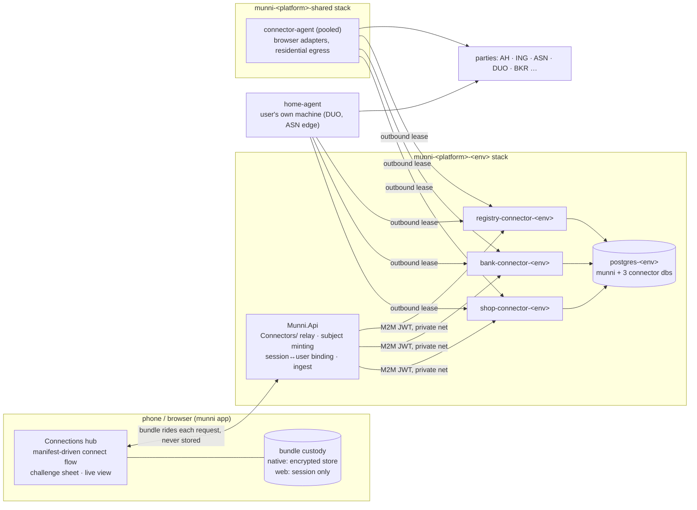

# Connector services — design and integration plan (#367)

Status: **proposal, 2026-09-29 — on hold until the questions in §12 are answered.**
Written against the code of `okkes/munniscrape` at `3943bbe` (branch `main`, 2026-09-28) and
munni at `8d610d20` (dev, 2026-09-29). Where the connector repository's documents and its code
disagree, this plan follows the code; the documents are three months behind it (§2).

Companion documents in munni: [wizard-family-env-plan.md](wizard-family-env-plan.md) (the
platform model the connectors join), [native-auth-popupless.md](native-auth-popupless.md) (the
native auth session the redirect challenge reuses), [functionality-checklist.md](functionality-checklist.md).

---

## 1 · Summary

munni gains three privately hosted **connector services** — shop (retail receipts), bank
(accounts open banking cannot reach) and registry (DUO, BKR, later pensions and mortgages) —
that read a user's own data from parties that offer no public API. The services already exist in
`munniscrape` (~99k lines of C#, 1.8k tests) and are good code. What does not exist yet is their
deployment as part of munni's platform, a relay in munni's API, any client UI, and the pieces the
connector documents promise but the code never got (webhooks, a vault, request scopes, session
binding, an IaC bootstrap).

The plan in one paragraph: **the connector repository keeps the kit, the adapters and the
images and gives up everything else** — its own IaC, its production compose, its demo client and
its stale specification — because munni's platform already owns deployment, secrets, the setup
wizard and the admin portal. The connectors run **per environment inside munni's stacks**, on a
private network nobody but munni's API can reach, authenticated with a Logto machine-to-machine
token per connector. munni's API carries the one relay, binds every connector session to the
signed-in user, ingests fetched data into the feed spaces the sync model already has (receipts
into the store feed, bank rows into IBAN-keyed feeds, registry positions as liability accounts),
and the web and native apps get one **Connections** hub: connect once globally, attach to any
space, review what matched. The existing on-device Albert Heijn / Jumbo integration and the API's
pass-through proxy are deleted in the same slice that brings the first retailer through the
connector.

Sixteen decisions need the owner's answer before the first line of code (§12); each carries a
recommendation. The rest of this document is the design those answers select from.

---

## 2 · The connector repository as it is — a critical reading

### 2.1 What is good, and why it should be kept

- **The kit's invariants are code, not prose.** `invalid_credentials` is non-retriable as a table
  constant with a `NeverRetry` set asserted by tests; a lying manifest refuses to boot; money
  units are declared per field and reconciled against the provider's own total; the DUO adapter
  refuses at request time to call the endpoint that returns a citizen's whole dossier.
- **Custody is designed, not promised.** Sealed session bundles (AES-256-GCM, key id, AAD bound
  to provider · subject · manifest version, re-issued on every use) make "the user's device holds
  the secret, the connector holds the key" real. Plaintext credential locations are enumerated and
  bounded by four purge paths.
- **The challenge relay works across every kind a party throws:** image, taps on a captcha,
  MFA code, app approval, select, redirect, QR/code display and a streamed live browser view with
  a clipped input grammar that cannot express navigation or script.
- **The agent model is right for this product.** Agents dial out only; a household can run one
  container (`home-agent`) holding every adapter and attaching to several control planes; the
  bundle for a persistent-profile provider holds no secret at all.
- **Deletion over deferral.** Zero `TODO`s, zero `NotImplementedException`s; three untestable
  retailer adapters were removed rather than disabled. Every non-obvious decision cites the bug
  that motivated it.

### 2.2 What is wrong, and what this plan does about it

| Finding | Evidence | Plan |
| --- | --- | --- |
| **The documents lie about the code.** The master design still says "nothing built yet"; the API spec documents webhooks, Valkey tickets, `server` custody with a vault, an audit table, scopes and `token.client == session.client` — none exist. The overnight report headlines adapters that were deleted. | `docs/connector-platform-design.md:3`, `connector-api-spec.md` §3/§8, `deploy/docker-compose.yml:50-59` ("no webhook sender exists", "server custody is unbuilt") | Rewrite `docs/` from the code (§7.4). The OpenAPI document served at `/scalar` becomes the wire contract; a snapshot test pins it. Stale documents move to `docs/archive/`. |
| **Session routes are not bound to the subject.** `GET /login/{sid}`, `/events`, `/challenges/{cid}/image`, `/answer`, `/cancel` accept any session id from any holder of the consumer credential. | `LoginEndpoints.cs:191,207,245,268,287` (`subject: null`) | Two fixes, both: the connector requires the subject on every session route; munni's relay binds session ids to users itself (§5.3). The reference relay in `demo-client` does neither — it is an IDOR in any multi-user consumer. |
| **Push notification has no mechanism.** The consumer spec's "web push when a login needs input" rides a webhook that was never written. | `git grep -i webhook */src` → comments only | SSE is the only channel. munni bridges the connector's SSE into its own `/sync/events` stream (§5.4); no webhook is built. Scheduled syncs that need a human are surfaced at the next app open, not pushed. |
| **Transport security is half-built and mis-specified.** Client certs are pinned by SHA-1 thumbprint while the IaC notes mint SHA-256; Kestrel is given no CA, so the pin is the only check; the reference relay has mTLS and M2M as placeholders. | `ConnectorOptions.cs:145-149`, `infra/README.md:132`, `demo-client/.../RelayOptions.cs:110-130` | Drop mTLS for the in-network deployment and rely on network isolation plus the Logto M2M JWT with a per-connector audience (§6, question Q2). The connector gains an explicit `Auth:Transport = network` production mode instead of a cert allowlist. |
| **The registry connector cannot be deployed by its own IaC.** Stack validation allows only `bank` and `shop`; the image workflow is gated on GitHub Environments the IaC cannot describe. | `iac.yml:104,249`, `release-images.yml:106-113` | Moot once munni's platform owns deployment (§8). The connector repository's `infra/` and its production compose are deleted. |
| **Tickets and idempotency are in-process memory.** Two API replicas break `resume → fetch`. | `ConnectorPlatform.cs:92` | One replica per environment is the deployment (§8); documented as a constraint, not fixed. |
| **Rate limits are advisory.** `limits.min_interval_seconds` is read by nothing; the only cap is a global queue depth of 50. | `ProviderManifest.cs:389-411`, `EfLeasedJobQueue.cs:119-126` | The connector enforces the manifest interval per subject+provider; munni's relay adds a per-user budget (§5.5). |
| **Admin routes share the consumer credential.** munni's token can pause a provider or enrol a canary. | `CatalogEndpoints.cs:133-225` | Acceptable once munni is the only consumer and exposes them under its own admin policy (§9); the connector's `RequiredScope` is wired so an `admin` scope is required for `/v1/admin/*`. |
| **Three spellings of one adapter fact.** `ShopAdapters__Ah__ClientId` must agree between the control plane, the pooled agent and the home agent, and nothing checks it. | `home-agent/appsettings.json:54-59` | munni's renderer writes every adapter option once and hands the same values to every container that needs them (§8.3); the connector's boot compares the agent's declared adapter digest with the control plane's and refuses a mismatch. |
| **Dead code survived a deletion.** `TenantShop.cs` (258 lines, no callers), `Fixtures/woo/*` (no callers), an unregistered `AsnDiscoveryAdapter`. | `shop-connector/.../Support/TenantShop.cs` | Delete; the discovery adapter moves under `tools/`. |
| **The bank agent binds no adapter options**, unlike every other host. A selector corrected on the control plane is corrected nowhere that matters. | `BankConnector.Agent/Program.cs:16` | Fix in Phase 0; a deployment test parses every host's configuration binding. |
| **`Connector.Kit.Hosting` — the control plane, 15.6k lines — has no test project of its own**; it is exercised only through the shop product's API tests. | `connector-kit/tests/` | A `Connector.Kit.Hosting.Tests` project in Phase 0, covering auth, session binding, expiry, and the live channel. |
| **Real financial data and a certificate with its private key sit in the working tree** (`temp/exports/*.csv`, `temp/scapegoat-main/scapegoat.pfx`), git-ignored but present; a 2.2 GB nested copy of munni beside them. | `temp/` | Not touched by this plan without an answer (Q14). |
| **Seven images where four would do.** The three agent images differ only by adapter pack; `home-agent` already hosts every pack. | `release-images.yml` | One agent image (`connector-agent`, the current `home-agent`) serves pooled and household roles; three control-plane images stay (§8.2). |
| **`demo-client` is a product, not a demo**: 2k lines of relay that munni must re-implement, a copy table of 634 strings, a Docker-socket path that creates containers. | `demo-client/` | Deleted; its relay logic and copy move into munni (§5, §10); its role as the connectors' own test harness is taken by a CLI smoke tool over the mock providers (§7.3). |

### 2.3 Provider reality (what a first release can actually offer)

| Connector | Real adapters | Verified against a live account | Not built |
| --- | --- | --- | --- |
| shop | `ah`, `lidl`, `jumbo`, `bol`, `coolblue`, `amazon-nl`, `mediamarkt-nl` (+6 mocks) | almost none — 79 UNCONFIRMED vs 7 OBSERVED markers; Jumbo's GraphQL document is a placeholder, Coolblue's fetch is a seam that names what to capture, MediaMarkt faces an interactive captcha and a persisted-query manifest | Picnic / Magento / WooCommerce (deleted), the e-mail order connector (proposed, highest value) |
| bank | `ing-nl` (T3), `asn` (T3, live view), `asn-persistent` (T4, household agent only) (+5 mocks) | ASN fully; ING from fixtures | ICS credit cards, SNS/RegioBank/BLG (one run each away — same platform as ASN) |
| registry | `bkr`, `duo` (+2 mocks) | both, from live captures | pensions (Mijn Pensioenoverzicht), mortgage portals |

Consequence: the first release should ship the mocks, Albert Heijn, ING and ASN, and treat every
other retailer as "connect at your own risk, a first live run will tell". The user-facing catalogue
must carry the connector's `status` (healthy / degraded / paused) per party so a half-verified
adapter never looks like a promise (question Q6).

---

## 3 · Target architecture



Properties this buys, each of which is a requirement in #367:

1. **Nobody but munni reaches a connector.** Control planes publish no port and join only
   `munni-<platform>-<env>` (default) and a new `munni-<platform>-agents-net`; the API is on the
   first, the pooled agent on the second, nothing else on either. Every call carries a Logto M2M
   token with the connector's audience. Health is the one anonymous route and it is reachable
   only from inside the network.
2. **Same container network as munni** — the control planes are services of the environment's
   own compose, next to `api-<env>`, rendered by `infra/modules/render.mjs` like every other.
3. **One deployment authority.** No connector IaC, no connector compose in production, no
   connector GitHub environments: munni's platform config, secrets manifest, deploy workflow,
   bootstrap and wizard cover them.
4. **Environments stay independent.** dev and prod each run their own control planes and
   databases (per-environment subject salts, so a subject is meaningless across environments);
   the pooled browser agent is the one shared piece because a Playwright image is large and the
   NAS has one egress anyway.
5. **Data lands where munni already keeps it** — feed spaces, the sync writer, deterministic ids —
   so every existing screen, matcher and test keeps working (§5.6).

---

## 4 · Decisions this plan makes

| # | Decision | Alternative rejected | Why |
| --- | --- | --- | --- |
| D1 | Control planes **per environment** | one set per platform in the shared stack | a dev bug pausing a provider must not pause prod; per-env Logto and postgres already exist; the containers are small (aspnet-alpine) |
| D2 | **Network isolation + M2M JWT**, no mTLS | keep the design's four layers | on a private Docker network the cert and the token would live in the same container environment, so mTLS adds a CA to mint and rotate for no attacker it stops; the connector gets an honest `network` transport mode (Q2) |
| D3 | **One agent image** (`connector-agent` = today's `home-agent`) for pooled and household roles; three control-plane images | seven images | the agent images differ only by adapter pack; `home-agent` already hosts all packs and is tested |
| D4 | **The pooled browser agent runs in the shared stack on the NAS** | a residential box | a NAS at home is on a residential line; if it is not (Q9), the agent moves — same image, same enrollment |
| D5 | **Client custody stays the default**; household agent for always-on; **no vault / server custody** | build the vault | server custody is unbuilt, and storing user credentials on the operator's box reverses the app's strongest promise; unattended sync exists honestly through the household agent (Q5) |
| D6 | **SSE only**; the relay bridges connector streams into munni's `/sync/events` | webhooks + web push | no sender exists; a bridge reuses the one channel the clients already hold |
| D7 | **The relay binds sessions to users** and the connector requires the subject on every session route | trust the consumer credential | closes the IDOR before the first multi-user deployment |
| D8 | **Server-side ingest**: the API receives fetch results, writes ops through `SyncWriter` into feed spaces, then acks | the client ingests | one write path (`GcIngest` precedent), thin clients, idempotent by deterministic op ids |
| D9 | **Registry positions are liability accounts** (`type: loan / mortgage / credit`) in a personal registry feed | a new `position` entity | munni's loans-v2 model already says "the liability account IS the debt"; the debts screen, upcoming and insights work unchanged |
| D10 | **The admin panel is munni's admin portal**; the demo client is deleted | keep a connectors console | "everything via the munni API" applies to operators too; the portal exists, has the auth and the cross-environment cockpit |
| D11 | **Global connections, attached per space** through the existing link mechanics (`storeConnLink`, `accountLink`) | per-space connections | the ticket's own requirement, and the model munni uses for bank feeds and store connections today |
| D12 | **Auto-match unreviewed transactions; propose matches against reviewed ones in a review inbox** | auto-attach everywhere | the ticket's rule; a match against a reviewed row changes something the user already signed off |
| D13 | The connector repository stays **separate and private**; munni references its images by channel tag | merge into the public monorepo | adapter code for banks and retailers must not be public; the quarantine argument is also a licensing one (Q4) |

---

## 5 · munni API — the relay

A vertical slice `server/src/Munni.Api/Connectors/`, mirroring `Banking/` and `GoCardless/`.

### 5.1 Files

```
Connectors/
  ConnectorOptions.cs        per service: BaseUrl, Audience, M2mAppId/Secret, SubjectSalt, timeouts
  ConnectorClient.cs         typed HttpClient per service: M2M token cache (Logto client_credentials),
                             retry policy (never on login), X-Manifest-Version capture, JSON pass-through
  SubjectMinter.cs           "u_" + base64url(HMAC-SHA256(salt_service, userId))[0..21] — one salt per service, per environment
  ConnectorSessions.cs       table ConnectorSessions(Id, UserId, Service, Provider, State, LastSeenAt) — the binding
  ConnectorRelayEndpoints.cs /connectors/{service}/…  (RequireAuthorization, demo/offline → 403)
  ConnectorSyncService.cs    resume → ticket → fetch (+ack) → ingest; runs for a user-triggered sync
  ConnectorIngest.cs         receipts → store feed; accounts+transactions → IBAN feeds; positions → registry feed
  ConnectorEvents.cs         SSE bridge: connector login/job stream → SyncEvents.Publish(user channel)
  ConnectorAdminEndpoints.cs /admin/connectors/… (AdminScope.Policy) and /control/connectors (cross-env, read-only)
```

Registration follows `BankingSetup.Register`: a service registers only when its `BaseUrl` is
configured; an unconfigured connector is simply absent (`/health` → `capabilities.connectors:
["shop","bank"]`), never a silent stand-in.

### 5.2 Relay surface

```
GET    /connectors                                  → which services this environment runs + catalogue digests
GET    /connectors/{service}/providers              → catalogue (ETag pass-through, status per provider)
POST   /connectors/{service}/{provider}/login       → 200 active | 202 challenge | error envelope
GET    /connectors/{service}/{provider}/login/{sid}
GET    /connectors/{service}/{provider}/login/{sid}/events            (SSE, bridged)
GET    /connectors/{service}/{provider}/login/{sid}/challenges/{cid}/image
GET    /connectors/{service}/{provider}/login/{sid}/challenges/{cid}/live/frame?after=
POST   /connectors/{service}/{provider}/login/{sid}/challenges/{cid}/live/input
POST   /connectors/{service}/{provider}/login/{sid}/answer
POST   /connectors/{service}/{provider}/login/{sid}/cancel
POST   /connectors/{service}/{provider}/sync        { bundle, since? }  → ingested counts + rotated bundle
DELETE /connectors/{service}/{provider}/sessions/{sid}   { bundle? }   → logged_out, job_id
GET    /connectors/{service}/agents                 → this user's household agents + health
POST   /connectors/{service}/agents/enrollment      → { code, expires_at, compose snippet }
DELETE /connectors/{service}/agents/{aid}
```

Rules the relay enforces (each with a test):

- **Subject substitution**: the client never sends a subject; the relay mints it from the user id.
- **Session binding**: `POST login` records `(sid, userId, service, provider)`; every `{sid}`
  route 404s when the row does not belong to the caller. `sync` and `DELETE` are bound through
  the bundle's own AAD (the connector rejects a foreign subject).
- **Bundles pass through memory only.** No `DbContext` write path takes a request or response
  body that can contain `bundle`, `credential_bundle` or `inputs`; an integration test scans the
  slice's write paths for those field names.
- **`resume` is hidden**: the client sends a bundle; the relay resumes, holds the ticket, fetches,
  acks, and returns the rotated bundle in the same response. A crash between fetch and ack loses
  one sync, never a connection (the connector re-serves un-acked results).
- **Demo and offline identities get `403 demo_identity`** — belt to the client's `apiFetch`
  braces. The demo seed gains connections against `mock-store-simple` and `mock-bank-simple`
  rendered from local fixtures, so the demo experience is complete with nothing leaving the device.
- **Device class** rides `X-Device-Class: native | web` from the client's own header; the
  connector caps web bundle TTLs.
- **Per-user budget**: a token bucket per user per service on `login` and `sync` (defaults: 10
  logins/hour, 12 syncs/hour), on top of the connector's per-provider interval.

### 5.3 The binding table and what it does not hold

`ConnectorSessions` holds ids and state, never a bundle, never inputs, never data. It exists so the
relay can answer "whose session is this" and so the admin diagnosis for a user can list their
connector sessions (extending `AdminUserDiagnosisDto`). Rows are deleted when the connector reports
the session `expired` or on `DELETE`.

### 5.4 Events

The relay opens the connector's SSE stream for a login or a job the user is waiting on and
republishes each `SessionResponse` (minus the bundle, which never rides SSE anyway) as a new event
kind on munni's `/sync/events` for that user: `{ kind: "connector", service, provider, sid, state,
challenge?, progress? }`. The client already holds that stream; no second `EventSource`, no CORS.
A stream is held at most 10 minutes (the connector's own cap) and only while a client is
subscribed.

### 5.5 Scheduling

- **Client custody (most providers):** a sync runs when the user opens the app or taps *Sync now*
  — the client holds the bundle, so the server cannot start one. Native shells sync on foreground
  like the store sync does today; the web app while the tab is open.
- **Household agent custody (T4):** the bundle holds `{agent_id, profile_id}` and no secret. The
  relay may keep such a bundle (it is not a credential) and a `ConnectorScheduleService`
  (`GcFetchService` shape, hourly tick, the provider's `min_interval_seconds` respected) runs
  unattended syncs; a run that stops for input is surfaced as a *needs you* card at the next open.

### 5.6 Ingest — into the model munni has

| Connector record | Lands as | Feed space | Id rule |
| --- | --- | --- | --- |
| `receipt` (+ items, invoice) | `receipt` row (global) + `receiptLink` per included space, `source: <provider>` | the owner's store feed (`storeFeedId(sub)`) | `rcpt:{provider}:{connectionId}:{external_id}` — the current `globalReceiptId` shape |
| `account` (bank) | `account` row, `source: 'connector'`, `provider: '<provider>'`, `iban` | `feedSpaceId(iban)`; wallets/cards without an IBAN: `CONN:{provider}:{external_id}` personal feed | `canonicalAccountId(iban)` — so a CAMT.053 upload of the same savings account merges |
| `transaction` (bank) | `transaction` op into the feed + `txMeta` overlay (prediction, `needsReview`) into each attached space | the account's feed | `ImportIds.TransactionId(iban, external_id)` — GoCardless and CAMT rows of the same fact converge |
| `credit_registration` (registry) | `account` row of a liability type (`loan` for DUO and instalments, `mortgage`, `credit` for revolving), `source: 'connector'`, `originalCents` = amount borrowed, `balanceCents` = outstanding where the party states it, `paymentCents`/`paymentEvery` where stated, `note` = the registry's own kind label | a personal registry feed `REG:{sub}` | `acct:{provider}:{external_id}` |

Every op gets a deterministic op id (`conn:{entityId}:{content_hash}`) so a re-fetch is a no-op,
HLC from `ServerHlc`, and `SyncWriter.ApplyAsync` — the server is one more device. Attaching to a
space stays the user's explicit step (`accountLink` / `storeConnLink`), exactly like today.

Type changes: `AccountSource` gains `'connector'`; `BankProvider` gains the connector provider ids
(or, cleaner, `provider` becomes `string` with the two open-banking ids kept as known values);
`ReceiptSource` already reserves `bol`, `coolblue`, `mediamarkt`, `amazon` and gains `lidl`;
`ReceiptRow` gains `document?: { mime, dataUrl }` for invoices (the connector's `include=invoice`).

### 5.7 Matching

- **Unreviewed transactions**: unchanged — `bestMatch` (one rung-1 single attaches by itself),
  `payment.iban_tail` / `card_last4` populated by the connector where the party exposes it.
- **Reviewed transactions (new)**: a receipt whose best candidate is already reviewed is not
  attached; it becomes a **proposed match** — a `receiptLink` with `proposedTxId` and `auto: 0`
  — listed in a *Matches to check* inbox on the Receipts screen and as a badge on the transaction
  detail. Accept writes `txId`; reject records the id in `rejectedTxIds` so it is never proposed
  again. The ladder (`candidateLadder`) stays the manual picker.
- **Review card (new row)**: the review deck gets a *Receipt* row for expenses — best unlinked
  receipts of included connections first, then camera/upload, attach and remove — the
  `ReceiptSection` logic, re-hosted.

---

## 6 · Security

| Layer | Mechanism | Where |
| --- | --- | --- |
| Reachability | control planes publish no port; networks `munni-<p>-<env>` (API side) and `munni-<p>-agents-net` (agent side) only; the health route is anonymous but unreachable from outside | `render.mjs` |
| Authentication | Logto M2M application per connector per environment, `client_credentials`, audience `connector.<service>`, minted by the Logto module at bootstrap like the account-deletion app; the connector validates issuer + audience and requires scope `admin` on `/v1/admin/*` | `infra/modules/logto.mjs`, connector `RequiredScope` (wired) |
| Subjects | per-environment, per-service HMAC salts generated at bootstrap; rotation severs every connection of that service; the connector never sees a user id, e-mail or name | manifest `CONNECTOR_SUBJECT_SALT_<SERVICE>` |
| Sessions | subject required on every session route (connector); user↔session binding (relay) | §2.2, §5.3 |
| Secrets in flight | bundles and inputs pass through the API's memory only; HTTP logging off on the relay group; no bundle on SSE | §5.2 |
| Secrets at rest | none on the server for client-custody providers; the bundle seal keys and the enrollment HMAC are per environment, generated, rotated by key id | manifest entries, §8.3 |
| Devices | native: bundles in the encrypted store, synced between the user's devices through the existing CSK device-enrollment channel (it wraps bundles instead of raw tokens — the protocol is unchanged); web: session storage only, `custody: 'ephemeral'` | `apps/web/src/features/connectors/bundles.ts` |
| Household agents | enrollment codes minted through the relay carry the subject; per-agent tokens hashed; revoke wipes the profile; the app shows the compose snippet with the code | §10.4 |
| Operator | `/admin/connectors/*` under `AdminScope.Policy`; provider pause/resume and canaries audited in munni's activity log; `/control/connectors` read-only across environments | §9 |
| Retention | the connector purges staged rows on ack or after 1 day; raw payloads never advertised in production; munni keeps only what it ingested | connector defaults |

Threats this does not address, stated so nobody assumes otherwise: a compromised API container
holds the M2M credentials and can drive any user's *live* session (it could today for bank sync);
a compromised NAS host can read the pooled agent's memory while a job runs. Both are the
architecture's accepted blast radius — live runs, never stored secrets.

---

## 7 · The connector repository — alignment work (Phase 0)

### 7.1 Delete

- `infra/` entirely (stack files, `iac.yml`, its secrets manifest and README) — munni's platform
  is the deployment authority.
- `deploy/docker-compose.yml` (production) — rendered by munni. `deploy/docker-compose.local.yml`
  shrinks to the adapter developer's loop (postgres + one control plane + one agent with Xvfb);
  `deploy/byo/docker-compose.yml` stays as the household compose munni renders the snippet from.
- `demo-client/` — relay → munni API, UI → munni web, copy → munni i18n, "Run one here" → gone.
- `shop-connector/src/ShopConnector.Adapters/Support/TenantShop.cs`, `Fixtures/woo/*`; the ASN
  discovery adapter moves to `tools/asn-discovery/`.
- Every stale document (§7.4).

### 7.2 Change

- **Auth**: `Connector:Auth:Transport = network | mtls`; `network` requires issuer + audience
  and refuses to boot without them; `RequiredScope` wired; SHA-256 thumbprints if `mtls` stays.
- **Subject on every session route.**
- **Interval enforcement**: `min_interval_seconds` per (subject, provider) on login and fetch,
  answered with `rate_limited` + `retry_after_seconds`.
- **Adapter option digest**: an agent's heartbeat carries a digest of its adapter options; the
  control plane refuses a lease to an agent whose digest differs from its own.
- **Bank agent binds `BankAdapters` options.**
- **One agent image** built from `home-agent/`, renamed `connector-agent`; `Class` is
  configuration; the pooled deployment sets `pooled`.
- **CI**: `build-test.yml` stays; `release-images.yml` loses the GitHub-Environment guards and
  builds four images per channel (`dev` → `dev`, `main` → `latest`) plus `:<channel>-<build>`;
  release-please for the repository's own version; CodeQL stays.
- **Tests**: `Connector.Kit.Hosting.Tests` (auth modes, session binding, expiry sweep, live
  channel, interval enforcement); an OpenAPI snapshot test per control plane; the compose readers
  keep parsing the remaining compose files.
- **Kit**: `ErrorCode` documented as 17 (adds `invalid_request`, `reconciliation_failed`);
  `X-Manifest-Version` on every response; `Idempotency-Key` honoured on every mutating route or
  the claim removed.

### 7.3 Keep a test harness without the demo client

`tools/smoke/` — a small .NET console that drives the public API of one control plane against the
mock providers end to end (catalogue → login → challenge → answer → resume → fetch → ack →
disconnect, every challenge kind, every runtime tier), used by the connector's own CI and by
munni's integration tests against the real images.

### 7.4 Documentation

`docs/` is rewritten from the code: `README.md` (what the platform is, the non-negotiables, the
layout), `architecture.md` (planes, custody, agents, retention — the true version of the master
design), `contract.md` (how to read `/scalar`, the record shapes, the error table, the challenge
kinds, the agent protocol), `adapters.md` (how to add a provider, verification markers, the
per-provider maturity table generated from the manifests), `deploy.md` (local loop, household
agent, what munni renders). `overnight-report.md`, `connection-service-design.md`,
`jumbo-login-repro.md`, `munni-integration-plan.md` and `connect-ux-plan.md` move to
`docs/archive/` with a one-line header saying what superseded them. `docs/research/` stays.

---

## 8 · munni platform — IaC and the wizard

### 8.1 Configuration

`infra/platforms/<p>/envs/<env>.json` gains `"connectors": ["shop", "bank", "registry"]` beside
`banking`; `infra/platforms/<p>/platform.json` gains `"browserAgent": true` for the shared pooled
agent. `stack.mjs` normalises them; `serve.mjs`'s allowlist accepts the three ids.

### 8.2 Rendering (`infra/modules/render.mjs`)

Per environment, for each enabled connector:

```yaml
  shop-connector-${e}:
    image: ${REGISTRY}/shop-connector-api:${CHANNEL}
    restart: unless-stopped
    networks: [default, agents]          # default: alias shop-connector; agents: the pooled agent
    environment:
      ASPNETCORE_ENVIRONMENT: Production
      Kestrel__Endpoints__Http__Url: http://+:8080
      Connector__Mode: Production
      Connector__Auth__Transport: network
      Connector__Auth__Authority: ${LOGTO_ENDPOINT}
      Connector__Auth__Audience: connector.shop
      Connector__Database__Provider: Postgres
      Connector__Database__ConnectionString: Host=postgres-${e};Database=shop_connector;Username=shop_connector;Password=${CONNECTOR_SHOP_DB_PASSWORD}
      Connector__Bundle__CurrentKid: k1
      Connector__Bundle__Keys__k1: ${CONNECTOR_SHOP_SEAL_KEY_K1}
      Connector__EnrollmentHmacKey: ${CONNECTOR_SHOP_ENROLLMENT_HMAC}
      ShopAdapters__Ah__ClientId: ${SHOP_AH_CLIENT_ID:-}
      BUILD_NUMBER: ${TAG}
    healthcheck: { test: ["CMD", "curl", "-fsS", "http://localhost:8080/v1/health"], … }
```

The API's block gains `Connectors__Shop__BaseUrl: http://shop-connector:8080`, the audience, the
M2M pair and the salt. `initdb/01-create-databases.sql` creates the three databases and roles per
environment. The shared stack gains `connector-agent` (image `connector-agent:${CHANNEL}`, on
`agents` network, `Class=pooled`, `Egress__Country=NL`, `Egress__Kind=residential` when the
platform declares a home line, `Headless=false` with the Xvfb entrypoint, `shm_size: 1gb`,
`init: true`, one enrollment connection per environment control plane, tokens generated). The
environment's `agents` network is `munni-<p>-agents-net`, external, created by the shared stack.

### 8.3 Secrets manifest entries

| Name | Owner | Scope | Feature |
| --- | --- | --- | --- |
| `CONNECTOR_<SVC>_DB_PASSWORD` | generated | env | connectors:<svc> |
| `CONNECTOR_<SVC>_SEAL_KEY_K1` (`_K2` blank until rotation) | generated | env | |
| `CONNECTOR_<SVC>_ENROLLMENT_HMAC` | generated | env | |
| `CONNECTOR_<SVC>_SUBJECT_SALT` | generated | env | (held by the API only) |
| `CONNECTOR_<SVC>_M2M_APP_ID` / `_SECRET` | module (Logto) | env | |
| `CONNECTOR_AGENT_TOKEN_<ENV>` | generated | platform, sharedOnly | browserAgent |
| `SHOP_AH_CLIENT_ID`, `SHOP_LIDL_CLIENT_SECRET`, … adapter options | operator | platform | connectors:shop |

`deploy-nas.yml` names each by name (the guard test `infra/tests/deploy-nas.test.mjs` fails on a
gap); `infra/modules/secrets.mjs`'s `featureOn` learns the `connectors` array like `banking`.

### 8.4 Wizard

- **Features** tick list: *Connector services* with three sub-ticks (shop / bank / registry) per
  environment, and *Browser agent* on the platform's shared services card.
- **Features & accounts** tile *Connectors*: adapter options that are operator-provided (the AH
  client id and its confirmation state, Lidl's client secret), with a *Check* that calls
  `/api/validate` → the environment API's `/admin/connectors/status` (every control plane's
  health, provider states, agent pool, queue depth).
- **Environment workspace** → a *Connectors* tab: per service health, providers with pause /
  resume, the pooled agent's last heartbeat, canaries (operator-only), and the household-agent
  enrollment instructions for the operator's own machines.
- **Bootstrap**: the Logto module mints the M2M applications and writes the pair back; generated
  keys are minted like every other; the runbook lists the one manual thing — the AH client id
  confirmation — with its verification step.

---

## 9 · Admin portal and control cockpit

`apps/admin`: a `connectors` screen — per service: health, provider table (state, since, reason,
sessions live / awaiting input, last error class), pause / resume (with reason key), agent pool
(name, class, last heartbeat, leased jobs, profiles healthy), queue depth, canaries (last ok, last
error). Actions go through `/admin/connectors/*`; every action logs to munni's activity history.
The per-user diagnosis lists the user's connector sessions and agents (ids and states, never data).

`apps/control`: `/control/connectors` — read-only, every environment's provider states and agent
liveness on one page, the same shape as the consents view.

---

## 10 · Client — web, Android, iOS

### 10.1 The Connections hub (`apps/web/src/features/connectors/`)

One screen replaces *Shopping connections* and the bank *Connect* door's provider pick:

- **Sections** Banks · Shops · Registries, each listing the user's connections as cards: logo,
  label, party status (healthy / degraded / paused), connection state (*synced 2 h ago* ·
  *sign in to sync* · *reconnect needed* · *blocked by the party* · *your agent is offline*),
  *attached to* chips (spaces), and one primary action per state.
- **Connect a party**: a catalogue rendered from the manifests (grouped by kind, search, party
  status shown honestly, "needs your own computer" marked for household-agent providers).
- **Attach**: after a connection is made, *use in* multi-select over the user's spaces (writes
  `storeConnLink` / `accountLink` per space, the same rows as today).
- Open banking (GoCardless / Enable Banking) keeps its own connect sheet but appears in the same
  Banks section so a user has one place for every party.

### 10.2 The connect flow

`manifestForm.ts` (pure, unit-tested per `flow` and per field type) turns a manifest into steps,
fields, validation, autofill and i18n keys; `ConnectFlowSheet` renders steps and live progress
(the typed `step` enum → munni copy); `ChallengeSheet` renders `image`, `taps` (touch/click
relay), `mfa_code`, `app_approval` (a waiting card), `select_option`, `code_display` /
`qr_display`, `redirect` and `live_view` (long-polled JPEG frames with tap and text input; the
clipped rectangle, never a full viewport). The redirect challenge on native opens the party's page
in the auth session already shipped for sign-in (`nativeAuth.ts`, ASWebAuthenticationSession /
Custom Tab) with the party's callback scheme as the session's callback; on the web it is the
paste-the-URL fallback the AH flow uses today.

### 10.3 Custody and sync on the device

`bundles.ts`: native → the encrypted store (rows `connectorConn` with `bundle`, never synced in
plaintext, never exported — the backup path skips the field); web → `sessionStorage`, row kept
with `custody: 'ephemeral'` and `needs_signin` shown as a normal state. Every relay response that
rotated the bundle replaces it in the same transaction that records the sync. The existing CSK
device-enrollment sync wraps bundles instead of store tokens — `/me/store-sync/*` is renamed
`/me/connection-sync/*` in the same commit (no compatibility layer, per the house rule).

`connectorSync.ts`: on app open / *Sync now* per connection: `POST …/sync` with the bundle →
counts and the rotated bundle; the ingested rows arrive through normal sync; the receipts matcher
runs per included space as today (`matchReceiptsIntoSpace`), plus the proposed-match pass for
reviewed transactions.

### 10.4 Household agent ("your own computer")

`AgentsScreen`: enrol (name → code → the compose snippet with the code and the control-plane
URLs, copy button, *what this is* explainer), health per agent (last seen, profiles), revoke (with
the warning that revoking destroys the profile that keeps the login alive). Providers that need it
say so in the catalogue and offer this screen before the login. First-class in the flow for those
providers, a settings-level door otherwise (Q13).

### 10.5 Receipts, invoices and review

- Receipts screen: connector receipts listed like store receipts today, with an *invoice* badge
  and a PDF viewer sheet for documents; *Matches to check* inbox (§5.7).
- Transaction detail: the receipts block shows an attached invoice with *open* and *remove*.
- Review card: the *Receipt* row (§5.7).

### 10.6 What is deleted from munni

`Shopping/StoreProxyEndpoints.cs` and its upstream allowlist; `features/shopping/stores/ah.ts`,
`jumbo.ts`; `ShoppingConnectionsScreen` (folded into the hub); every store hostname; the
`shop.jumboBlocked` family of copy. `storeReceipts.ts` (the matcher), `ReceiptSection`,
`ReceiptsScreen`, the receipt entities and the feed mechanics stay — the connectors emit the
shapes they already consume.

### 10.7 Migration of existing store connections

Albert Heijn holds a durable refresh token on the device: the connector's `existing_refresh_token`
login input adopts it silently and the raw token is deleted once a bundle exists. Jumbo's session
cookies are not adopted: the connection is marked *reconnect needed*. No compatibility layer
survives the release that ships the hub; the old adapters are removed in that same release
(house rule: no migration code, one release, nothing implicit).

### 10.8 Copy, tours, docs

Every `message_key` / `label_key` / `step` the connectors emit has EN/NL/TR copy in munni; a test
walks the shipped manifests and error catalogue and fails on a missing key (the `CopyCoverageTests`
idea, moved). Tours: *Connections* (hub, connect, attach, agents) replaces the *shop* tour; the
receipts tour gains the matches inbox. The functionality checklist and What's New follow per slice.

---

## 11 · Delivery — slices and gates

Each slice is one push, green on every gate (web / admin / control / API / infra tests, tsc,
Sonar, CI including the native builds where the client changed), with its checklist and tour
updates in the same commits.

| Slice | Repository | Delivers | Proof |
| --- | --- | --- | --- |
| **C0 Alignment** | munniscrape | §7 in full: deletions, auth transport mode, subject binding, interval enforcement, adapter digest, one agent image, CI, hosting tests, docs rewrite, smoke tool | the smoke tool green against every mock; images on `dev` |
| **M1 Relay** | munni API | §5 against the mock providers; admin/control endpoints; demo seed connections | API tests with the real `dev` images as test containers; the write-path scan; binding tests |
| **M2 Platform** | munni infra | §8: config, render, secrets, deploy workflow, bootstrap (M2M apps), wizard tiles and tab, control cockpit | infra tests; a dev environment bootstrapped with connectors and the agent enrolled |
| **M3 Hub + shop cutover** | munni web/native | §10.1–10.3, §10.6–10.8 with the shop connector; AH migrated, Jumbo reconnect; receipts ingest; review row; matches inbox; invoices | web tests (RTL) per screen; the existing receipts test suite unchanged; native builds green; a live AH connect on dev |
| **M4 Bank** | munni | bank accounts and transactions into feeds, `source: 'connector'`, attach flow, ING and ASN, live view on native and web | a live ING connect on dev; CAMT merge test |
| **M5 Registry + agents** | munni | liability accounts from BKR/DUO, the agents screen, household enrollment end to end | a household agent enrolled from the app; a DUO fetch on the owner's account |
| **M6 Admin** | munni admin | §9 | admin tests; pause/resume proven on dev |

C0 must land before M1; M1 and M2 can proceed in parallel; M3 needs both; M4–M6 follow in any
order. Nothing is merged to master until M3 — the first user-visible slice — is complete, so the
production app never carries a half-built hub.

---

## 12 · Questions for the owner

Each question names the recommendation this plan assumes. An answer of "as recommended" on all of
them is enough to start C0.

1. **Placement (D1).** Control planes per environment, rendered into each environment's stack — or one shared set per platform? *Recommended: per environment.*
2. **Transport (D2).** Drop mTLS in favour of network isolation plus the Logto M2M token, adding a `network` auth mode to the connector — or keep mTLS with an internal CA minted by bootstrap? *Recommended: drop mTLS.*
3. **Demo client (D10).** Delete it and give the admin portal a Connectors screen — or keep a standalone connectors console? *Recommended: delete; the connector repository keeps a CLI smoke tool for its own testing.*
4. **Repositories (D13).** Is `munniscrape` private, and does it stay separate (images consumed by channel tag)? Merging into the public monorepo would expose the adapters. *Recommended: separate and private; munni pins image channels, not versions.*
5. **Custody (D5).** Client custody by default — web users sign in each visit unless they run a household agent; no vault / server custody in this arc. Acceptable? *Recommended: yes.*
6. **First parties.** Ship the mocks, Albert Heijn, ING and ASN in M3/M4; every other retailer stays in the catalogue marked by its verification state (Jumbo, bol, Coolblue, Amazon, MediaMarkt are fixture-tested only, MediaMarkt is likely blocked). Agree, or should any be hidden until verified live? *Recommended: show with honest status.*
7. **E-mail order connector.** The connector research rates reading order confirmations from the user's own mailbox as the highest-value shop source (universal coverage, no bot protection). Not in the ticket — in scope for a later slice, or off the table? *Recommended: a later slice, separate ticket.*
8. **MediaMarkt invoices.** The ticket names MediaMarkt for invoices; the adapter is unverified and the site presents an interactive captcha. Accept "best effort, may need the live view and may be blocked", with invoices supported generically for any party that returns them? *Recommended: yes.*
9. **Where the pooled browser agent runs.** Is the NAS on a home (residential) line, and what CPU architecture is it? The agent image is amd64 only today. *Recommended: the NAS's shared stack if it is amd64 on a home line; otherwise a mini PC with the same image.*
10. **Unattended sync.** For client-custody providers, syncs happen only when the app is open (native: on foreground; web: while the tab is open). Is that acceptable for the first release, with always-on reserved for household-agent providers? *Recommended: yes.*
11. **Reviewed-transaction matches (D12).** A *Matches to check* inbox on the Receipts screen plus a badge on the transaction — or inside the review deck? *Recommended: the inbox; the review deck gets the plain Receipt row.*
12. **Registry positions as accounts (D9).** DUO as a loan account, BKR registrations as loan / mortgage / credit accounts in a personal registry feed, attachable per space and visible on the debts screen. Agree? *Recommended: yes.*
13. **Household agents in the UI.** First-class in the connect flow for providers that need one (DUO, ASN edge login) and a settings-level door otherwise — or hidden behind a power-user switch? *Recommended: first-class where needed.*
14. **The `temp/` folder in munniscrape** holds real bank exports, a `.pfx` with its private key and a 2.2 GB copy of munni, git-ignored but on disk. May C0 delete it (keeping the exports elsewhere if they are parser ground truth)? *Recommended: delete from the tree; move the exports to a private fixtures location.*
15. **Open banking in the hub.** Fold the GoCardless / Enable Banking connect door into the Connections hub's Banks section (one place for every party) — or leave bank connect where it is? *Recommended: fold in.*
16. **Kill switch scope.** With per-environment control planes, pausing a party pauses it in one environment; is a platform-wide pause needed (a control-cockpit action that fans out)? *Recommended: per environment, with a fan-out button in the cockpit later if wanted.*

---

## 13 · Risks

| Risk | Mitigation |
| --- | --- |
| A retailer changes its site and a fixture-tested adapter never worked live | honest status in the catalogue; canaries on the operator's own accounts; `provider_changed` flips the party to degraded and the hub says so |
| The bundle rotation loses a connection on a crash mid-sync | the connector re-serves un-acked results; the client keeps the last bundle until the new one is written |
| Bot protection blocks the pooled agent's address | `blocked_by_provider` stops the connection, no escalation; the household agent path exists for the user who wants always-on |
| The subject salt of an environment leaks | rotate it — every connection of that service is severed, nothing else is exposed |
| Scope creep in the hub | the hub ships with shop only (M3); bank and registry sections appear with their slices |
| Two API replicas | not deployed; the constraint is documented in the platform README |

---

## 14 · Delivery log

**2026-09-29 — C0 delivered** (`feat(connectors): port …` and the four commits after it). Where it
departs from §7, and why:

- **Auth transport**: no `network | mtls` switch. The owner chose network isolation plus the Logto
  machine token; the SHA-1 thumbprint half is removed rather than kept as an option nobody deploys.
  `RequiredScope` is honoured; `/v1/admin/*` wants `AdminScope`.
- **Interval enforcement** applies to calls that declare `X-Connector-Trigger: schedule`; a person is
  never held to it (the manifest's own note on the six Amazon fetches in three hours decided that).
- **The adapter digest** is the catalogue digest both registries already compute, carried in the
  agent's capabilities; a mismatch is leased nothing and listed as stale.
- **The ASN discovery adapter stays in the bank pack**, unregistered, beside the options it
  produced — it needs the agent runtime and is not a tool that runs on its own.
- **The smoke tool (§7.3)** moves to M2, where there is a deployed image to point it at; the control
  plane's own suite drives the public API end to end against the mock providers meanwhile.
- **CI** is munni's: the images join `release-images.yml`, the per-assembly union coverage gate
  runs after the tests, Chromium is installed for the agent's browser tests.
- Documentation is under `docs/connectors/` (README, architecture, contract, adapters, deploy).
- **Found on the way**: the inline runner reported a job's outcome before its own progress pump had
  drained, so a fast run lost its last steps — the intermittent `RefreshLoopApiTests` failure of
  2026-08-12. It flushes first now, as the agent runtime always did.

**2026-09-29 — M1 delivered** (`feat(api): the connector relay`; docs/connectors/relay.md). Where it
departs from §5, and why:

- **No `{service}` segment.** Phase A unified the three control planes into one host per environment,
  so the relay has one upstream (`Connectors:BaseUrl`), one audience, one subject salt, and the routes
  are `/connectors/{provider}/…`; a provider's kind comes from the catalogue.
- **The app's casing.** Every connector document — sessions, jobs, challenges, the catalogue, the
  error envelope — is rendered in camelCase like the rest of this API; `config`, `inputs`, `params`
  and `raw` keep their keys. The plan's "JSON pass-through" would have left the app with two
  conventions for the same field.
- **Events: the bridge only.** A login or job in flight is republished on `/sync/events` as
  `{ kind: "connector", … }` (§5.4); there is no per-session SSE route on the relay. The bridge
  starts when the relay answers with a run still in flight, not when a client subscribes.
- **`connectionId` on login.** The client's stable id for a connection rides every login, so a
  receipt is keyed by the connection (`rcpt:{provider}:{connectionId}:{external id}`) rather than by the
  session that happened to fetch it — a re-login would otherwise have duplicated every receipt.
- **Jobs are collected, not polled into existence.** `GET …/jobs/{id}` is read-only (the page of
  records never reaches the app); `POST …/jobs/{id}/collect { bundle }` ingests, acknowledges and
  returns the rotated bundle — the acknowledgement needs a ticket, the ticket needs the bundle, and
  only the app holds it.
- **Ingest files per record, not per resource**: a bank's transactions pass carries its accounts;
  the connector's id prefix says what a record is.
- **Documents as a list.** A receipt carries `documents[]` (`mime`, `dataUrl`, `filename`,
  `sizeBytes`) rather than one `document`, for the reason the connector made it a list: Amazon
  issues one invoice per shipment.
- **No overlay at ingest.** A connector bank feed has no target space when it is created (attach is
  the user's explicit step), so no `txMeta` is written; the GoCardless ingest writes one because a
  consent starts from a space.
- **No `demo_identity` code.** Demo and offline identities carry no token, so they never reach the
  relay; there is nothing server-side to refuse.
- **The kill switch's states are the control plane's own** — `healthy`, `degraded`, `paused`,
  `retired`; contract.md said `active` and was wrong.
- **Audit**: munni has no server-side activity table (the activity log is the members' own, per
  space); an operator's pause, resume or revoke is written to the server log with the operator's
  subject.
- **Deferred**: the demo seed's connections (client-side shapes, M3); `ConnectorScheduleService`
  for household-agent custody (M5, with the first T4 provider in the app); a `provider` narrowing of
  the client's `AccountSource`/`ReceiptSource` unions (M3, where the rows are read).
- **Tests** boot the control plane in-process (`Connector.Kit.Hosting` + the packs' mocks, Sqlite)
  behind the relay's HttpClient instead of pulling the images as test containers: the same code
  path, no Docker in the unit-test lane.

**2026-09-29 — M2 delivered** (`feat(infra): the connector platform rendered`; docs/connectors/deploy.md
"What munni's platform renders"). Where it departs from §8, and why:

- **One control plane per environment, not three.** `features.connectors: true` (a boolean, not a
  list of services) renders `connector-<env>` with every pack; the plan's per-service containers,
  databases, keys and secrets collapse to one of each — the same unification M1 leaned on.
- **The control plane has a published host.** §3 and §6 said "publishes no port"; household agents
  dial it from home, and DSM's reverse proxy routes by host, not by path, so the honest shape is a
  host of its own (`munni-<env>-<platform>-connector`, port 8387 + 100·slot) whose every route wants
  a machine token or an agent's own token. architecture.md's reachability row says so now.
- **No agents-only network.** The pooled agent dials each control plane over the platform's shared
  network; the control plane carries an alias `connector-<env>` there. A second external network
  that the shared stack must create before any environment can start bought isolation between the
  operator's own agent and the operator's own services, and nothing else.
- **The fleet enrolls with a standing code.** The plan's "tokens generated" for the pooled agent
  became `Connector:FleetEnrollmentCode` (a control plane change): a platform secret
  (`CONNECTOR_FLEET_CODE`), production-allowed, seeded under the subject `fleet` and re-armed on
  every start so an agent with a wiped state file comes back — the development code stays
  development-only because the code IT exists for is written in a checked-in file.
- **One database, one password.** The control plane's database is `connector` on the environment's
  Postgres, under the environment's own `munni` user (one `POSTGRES_PASSWORD` per server, as Logto's
  database already is), not a role and password of its own.
- **No operator adapter options.** Every adapter option (AH client id, selectors, URLs) is a provider
  fact with a default in the pack; nothing is a secret the operator holds, so the manifest carries no
  `SHOP_*` entries and the wizard no Connectors tile — only the environment's tick, the platform's
  agent tick and a Connectors tab that shows the rendered facts and checks the control plane's
  liveness through the helper. Provider states, pause / resume, the pool and the canaries are the
  admin portal's (M6): the wizard holds no operator token for an environment's API.
- **The relay waits for its credential** instead of refusing to start: the machine pair is written
  back by the Logto module after the environment's first bootstrap, and an api that refused to boot
  before it existed could never reach that bootstrap. A base URL that is not one, a missing salt or
  half a pair still refuse with the setting's name.
- **The control plane learned two settings** for the local platform: `Connector:Auth:MetadataAddress`
  and `RequireHttpsMetadata`, so it fetches its Logto's discovery document in-network over http while
  the issuer stays the browser-facing url — the same pair munni's api carries.
- **Deferred**: the smoke tool (§7.3) — the relay's in-process control plane tests drive every mock
  through the real routes, which is what the tool was for; a CLI against a deployed image can follow
  when a deployed environment exists to point it at.

**2026-09-29 — M3 delivered** (`feat(api): connection sync replaces store sync`, `feat(web): the
Connections hub`; docs/connectors/client.md). Where it departs from §10, and why:

- **No `existing_refresh_token` adoption (§10.7).** No shipped manifest carries the input — Albert
  Heijn signs in through the live view — and an input that exists for one migration would be carried by
  the adapter forever. Every pre-existing store connection is a fresh sign-in through the hub. Since
  the hub keeps the connection's id, the receipts already on a device keep their rows:
  `rcpt:{provider}:{connectionId}:{external id}` is the shape both sides always used.
- **Shops only in the hub (§10.1).** The Banks and Registries sections are not rendered until their
  slices exist; a section listing the open-banking consents beside no connector would be the hub
  pretending. The catalogue sheet filters to `kind: store` for the same reason.
- **Custody is one function** (`features/connectors/bundles.ts`): a bundle in the device-only row
  means device custody wherever the row was written; the web keeps the bundle in `sessionStorage` and
  the row without it — so a ciphertext pulled from the E2EE sync lands in the right place on either
  device class, and the row reads "sign in to sync" when the tab is gone.
- **The synced rows stay `storeConn` / `storeConnLink`** (§10.1, "the same rows as today"); their
  `store` field carries the connector provider id now, `ReceiptSource` is `'photo' | provider id`,
  and the dead `storeMarker` entity and the `storeInstances` token table go — Dexie version 2, the
  schema's first delta since the clean slate.
- **The invoice rides the snapshot.** A `receiptLink` carries `documents[]` the way it carries a
  photo's image: a member opens the invoice without reading the owner's feed.
- **Proposals live on the link** (§5.7): `proposedTxId` and `rejectedTxIds`, written by the matcher,
  decided under *Matches to check* on the Receipts screen or on the transaction itself. A pass never
  attaches to a reviewed transaction and never re-proposes a rejected one; a receipt with a proposal
  is still re-evaluated when better candidates arrive.
- **Connector frames are one in-process bus** (`features/connectors/events.ts`): the sync engine
  hands every `{ kind: "connector" }` frame to it, and a flow or a sync in flight subscribes to its
  session or job and reads the view afresh — a frame says "something moved", never what the bundle is.
- **A job's question waits for a human.** An unattended sync (app open, after a bank sync) that
  meets a question stops with `asking`; *Sync now* in the hub answers it in a sheet. Nothing is
  answered on the user's behalf.
- **The connection sync is renamed, not versioned** (`/me/connection-sync/*`, tables
  `ConnectionSyncDevices` / `ConnectionCiphers`, the HKDF label `munni-connection-sync-v1`): a rename
  migration keeps the ciphertext rows; no compatibility layer keeps anything else.
- **The copy test walks the sources** (`features/connectors/copyCoverage.test.ts`): every
  `connect.*` literal under `server/src/connectors` and every member of the wire enums (error codes,
  job steps, session states, user actions, challenge types) must have EN, NL and TR copy — the test
  lives in the web suite, where the copy lives, and fails before a raw key reaches a screen.
- **Deferred**: the household agents screen (M5); the review deck's *Receipt* row (§5.7) — the
  transaction detail carries the proposal for now, the deck row follows with the bank slice's review
  work; a gallery spec for the hub (the RTL suite drives the catalogue, the form, a code challenge,
  a refusal, *Sync now* and removal against a mocked relay); a live Albert Heijn connect on dev, which
  waits for the first environment that runs connectors.
