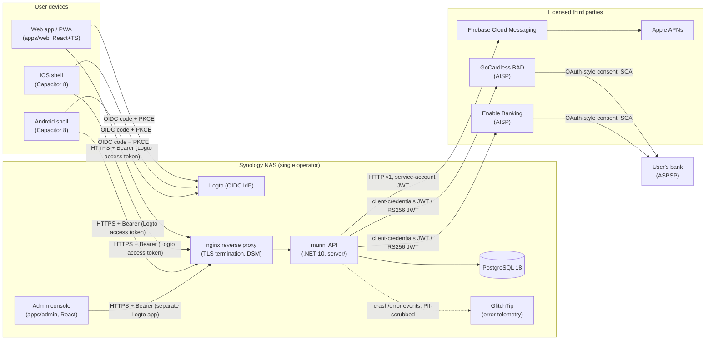
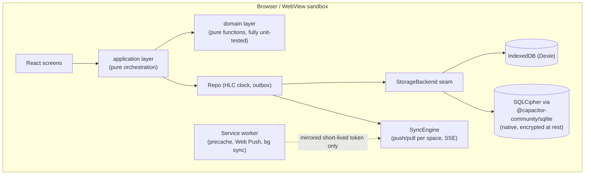
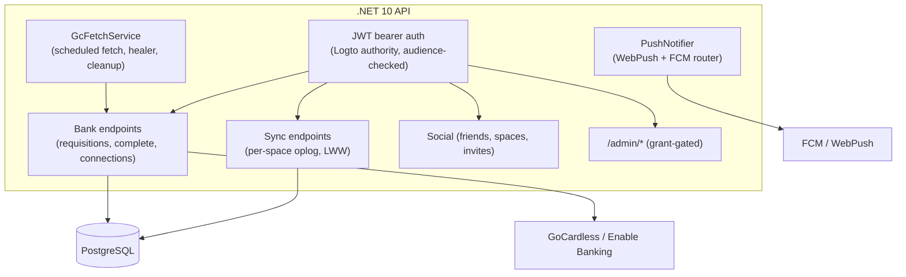
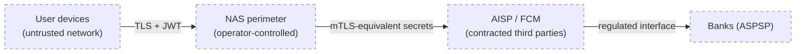

# munni — system architecture & security review (PSD2 lens)

> Written 2026-07-19 for an external security evaluation. Every diagram is
> generated from the code as it ships in v2.19.x; nothing here is aspirational.
> munni is an **account-information consumer** (read-only AIS) — it never
> initiates payments and never sees bank credentials. Strong Customer
> Authentication happens exclusively at the bank, brokered by a licensed
> AISP (GoCardless Bank Account Data or Enable Banking).

## 1 · System landscape



Key property: **the API is the only component that holds bank-data
credentials**; devices never talk to an AISP directly, and the AISP — not
munni — performs SCA with the bank.

## 2 · The apps in isolation

### 2.1 Web app (`apps/web`) — local-first PWA



* **Local-first**: every feature works offline; the server is only a sync
  relay. All writes go through the Repo → outbox → sync engine.
* **Encryption at rest**: on native shells the store can run on SQLCipher
  with a Keychain/Keystore-held passphrase. Browser storage relies on the
  OS user profile sandbox.
* **Telemetry discipline**: demo/offline identities have a hard
  zero-network gate (enforced at the single `apiFetch` choke point and a
  Sentry `beforeSend` gate). Only signed-in users emit crash reports.

### 2.2 Native shells (`apps/native`) — thin Capacitor wrappers

* Same web bundle, packaged; no additional business logic.
* OS integration only: push token registration (FCM/APNs), biometric app
  lock, haptics, camera (receipts), universal links
  (`/gc-callback`, `/splits/join/*`, `/native-auth*`).
* Keyboard resizes the WebView natively; the webview origin is
  `capacitor://localhost` — cookies/storage are app-sandboxed.

### 2.3 API (`server/`) — .NET 10, vertical slices



* **Access model**: every space read/write checks membership; feed spaces
  (raw bank data) are readable only through ownership or an explicit
  attachment (`SpaceAccountLink`), with archived links frozen at a
  sequence ceiling (departed members keep exactly the history they had).
* **AISP credentials** (GoCardless secret, Enable Banking RS256 private
  key) live only in server configuration (Docker env from the NAS
  `.env`), never in any client bundle.
* **Admin surface** is a separate Logto application and additionally
  gated by an explicit server-side admin grant list.

### 2.4 Admin console (`apps/admin`)

Operator-only React SPA: overview/quota, user management (incl. GDPR
deletion and per-user sync-chain diagnosis), bank-connection upkeep,
category catalog publishing. Shares **no code** with the member app and
holds no bank data of its own — everything goes through `/admin/*`.

## 3 · Cross-app flows

### 3.1 Sign-in (OIDC, code + PKCE)

```mermaid
sequenceDiagram
  participant App as Web/native app
  participant Logto
  participant API
  App->>Logto: authorize (code + PKCE, https universal-link redirect on native)
  Logto-->>App: code → tokens (access + rotating refresh)
  App->>API: Bearer access token (audience: munni API)
  API->>Logto: JWKS validation (cached)
  Note over App: token refresh is single-flighted;<br/>only a REJECTED bearer can clear the session
```

### 3.2 Bank consent (read-only AIS; SCA at the bank)

```mermaid
sequenceDiagram
  participant User
  participant App
  participant API
  participant AISP as GoCardless/EB
  participant Bank
  App->>API: create requisition (space, institution)
  API->>AISP: create consent, redirect=munni /gc-callback
  App->>AISP: user follows consent link
  AISP->>Bank: SCA — credentials + strong auth AT THE BANK only
  Bank-->>AISP: consent granted (90 days, read-only scopes)
  AISP-->>App: redirect to /gc-callback (universal link)
  App->>API: complete requisition (idempotent, quota-tolerant)
  API->>AISP: list accounts → ingest transactions
  API-->>App: feed space synced to every member device
  Note over API: hourly healer finishes interrupted consents;<br/>daily cleanup revokes unused ones at the AISP
```

munni never sees bank credentials; it stores only the AISP's account ids,
IBAN, and transaction data the user consented to. Consents are revocable
in-app (deletes the requisition at the AISP) and auto-expire.

### 3.3 Sync (the only data plane)

Per-space append-only oplog; hybrid logical clocks; last-writer-wins per
field. Devices push queued ops and pull since a cursor; membership is
re-derived server-side on every request. Access loss (leaving a space,
revoked share) purges the local copy on the next sync.

### 3.4 Push

Data payloads carry facts, not content decisions; visible text is
localized per device (server-side for FCM, in the service worker for Web
Push). Tokens are stored per user and pruned on 404/410.

## 4 · Security controls, mapped

| Concern (PSD2 / AIS lens) | Control in munni |
| --- | --- |
| SCA | Never performed by munni — delegated to the bank via a licensed AISP. |
| Scope of access | Read-only account information; no payment initiation exists anywhere in the codebase. |
| Consent lifetime | AISP-enforced (90 days); in-app revoke; server cleanup revokes idle consents at the provider. |
| Bank credentials | Never touch munni — entered only on the bank's own pages. |
| AISP secrets | Server-side env only; never in client bundles or the repo. |
| Transport | TLS everywhere (DSM reverse proxy, HSTS); native shells pin to https universal-link origins. |
| At rest (server) | PostgreSQL on the operator's NAS volume; deletion pipeline erases user data + revokes consents + deletes the IdP identity (prod). |
| At rest (device) | Native: optional SQLCipher store, passphrase in Keychain/Keystore; app lock via OS biometrics. |
| AuthN | OIDC code+PKCE via Logto; rotating refresh tokens; audience-checked JWTs; single-flighted refresh to avoid rotation races. |
| AuthZ | Space membership checks on every sync route; feed access derives from ownership/attachment with archive ceilings; admin = separate app + explicit grant list. |
| Multi-user shared accounts | Each consent lives independently per user; one user's cleanup can never revoke another's access. |
| Telemetry | PII-scrubbed error events only; demo/offline identities emit zero network traffic by construction. |
| Data minimization | Server stores only what sync needs (ops + derived rows); budgets/goals stay client-side interpretation of synced facts; no analytics/tracking of any kind. |
| Auditability | Append-only oplog per space; admin diagnosis surfaces the exact chain (feeds, attachments, consents) per user. |

## 5 · Trust boundaries at a glance



Residual risks worth stating honestly: the NAS is a single-operator,
single-node deployment (no HSM, no WAF beyond DSM defaults); browser-profile
storage on the plain web app is not additionally encrypted; and GlitchTip
receives stack traces which could incidentally contain identifiers if a
future code path interpolated them (the current reporting scope tags are
curated to avoid this).
