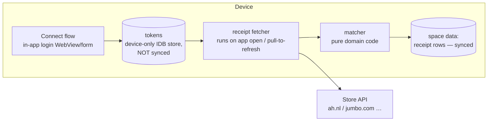

# Receipts & shopping integrations — design

Status: **S1 built 2026-07-09** (photo receipts + tx section + connections skeleton); S2 next: AH adapter, matcher, proxy, OCR container.

## Confirmed rulings

1. Store tokens are **device-only**; a new phone reconnects by design. ✓
   Softener: the space syncs a secret-free **connection marker** (store +
   who connected + status), so a device without a local token shows a
   "Reconnect to {store}" notice instead of silently doing nothing.
2. The pass-through proxy is **acceptable** (stores nothing, logs
   nothing, demo/offline never reach it). ✓
3. Photos are **downscaled** and synced. ✓ Plus: a free lightweight
   **OCR container on the NAS** (Tesseract HTTP service) converts photo
   receipts to text server-side — user identities only, opt-in flow,
   feeding the same line-item shape store adapters produce.

## The idea

A transaction can carry a **receipt**: the line-item proof of what was
actually bought. Two ways in:

1. **Photo** — always available: snap/pick a picture, stored on-device
   (downscaled), synced as an attachment to the space.
2. **Store connection** — for supported shops the app fetches digital
   receipts and **matches them to transactions automatically** (same
   amount ± cents, date ± 2 days, merchant match).

Target stores (NL-first): **Albert Heijn, Jumbo, bol.com, Coolblue,
MediaMarkt, Amazon**.

## The honest constraint: (mostly) no public APIs

None of the six offer a public receipts API. The community route
(appie-go for AH, the AH receipts gist) uses the **mobile app's own
endpoints**: an anonymous-member or username/password login yields a
bearer/refresh token, `…/receipts` lists them, `…/receipts/{id}` gives
line items. That shape repeats across stores with varying friction:

| Store | Community knowledge | Login shape | Feasibility |
|---|---|---|---|
| Albert Heijn | appie-go, receipts gist | app OAuth (code or anonymous member + upgrade) | **good — start here** |
| Jumbo | several scrapers | username/password → token | good |
| bol.com | order history scrapers | username/password + occasional captcha | medium |
| Coolblue | little | password + captcha | hard, later |
| MediaMarkt | little | password + 2FA | hard, later |
| Amazon | order exports, scrapers | password + 2FA + bot detection | hard, later |

**Phase S1 ships AH + Jumbo**; the others follow as adapters when a
working recipe is proven (research task per store).

## Privacy architecture (non-negotiable)

Store credentials and tokens **never touch our server**. The whole
integration is client-side, matching munni's local-first law:



- The store login runs **on the device** (embedded form; the store sees
  the user's own IP — also friendlier to bot detection than a server
  farm). Tokens + refresh tokens live in a device-only table (never in
  the synced space, never on our API).
- One wrinkle: browser **CORS**. The store APIs don't send CORS headers,
  so a *thin server proxy per store* forwards requests **with the
  client's token in the request** — the server stores nothing, logs
  nothing, and demo/offline identities never reach it. (Documented in
  the endpoint: pass-through only.)
- Keep-alive: the fetcher refreshes tokens opportunistically whenever
  the app opens; an expired refresh token surfaces a "reconnect to
  Jumbo" row exactly like an expired bank consent.

## Data model

```
transaction.receiptId?: string            // synced pointer
receipt (synced, per space) {
  id, spaceId, txId?,                     // txId set once matched
  source: 'photo' | 'ah' | 'jumbo' | …,
  date, totalCents, merchant,
  items?: { name, qty, unitCents, totalCents }[],
  image?: string                          // downscaled data URL (photo path)
}
storeConnection (DEVICE-ONLY table, not synced) {
  store, tokens, refreshedAt, status
}
```

## UX

1. **Tx detail** gains a *Receipt* section: shows the matched receipt's
   line items (or the photo); empty state offers *Take photo* /
   *Connect a store*.
2. **Settings → Everywhere → Shopping connections**: per-store connect
   (login form/WebView), status, last fetch, disconnect.
3. **Matching**: on fetch, receipts auto-attach to the best transaction
   candidate; ambiguous ones land in a small "unmatched receipts" list
   (review-like) where a tap picks the transaction manually.
4. Line items open the door to future per-item analytics (out of scope
   here).

## Rollout

- **S1** — data model + photo receipts (capture, store, view) + tx
  detail section. Zero store risk, immediate value.
- **S2** — AH adapter (anonymous member flow per appie-go), matcher +
  unmatched list, server pass-through proxy, connection keep-alive.
- **S3** — Jumbo adapter; adapter interface hardened.
- **S4** — research spikes for bol/Coolblue/MediaMarkt/Amazon, ship as
  each recipe proves out.

## Open questions

1. OK that store tokens are device-only (a new phone must reconnect
   stores — by design)?
2. The pass-through proxy is required by browser CORS; acceptable given
   it stores nothing, or should S2 wait until we've verified AH works
   without one (some endpoints allow it)?
3. Receipt photos sync as downscaled images inside the space (~100 KB
   each) — fine, or device-only?
